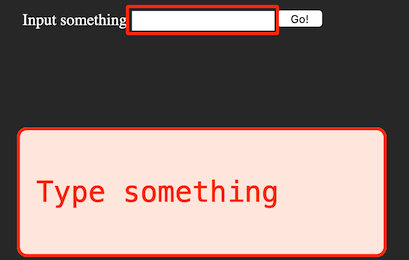

# Cypress guided tour plugin

A simple plugin to add guided tour functionality to cypress steps

<div>
    <a href="https://www.npmjs.com/package/cypress-plugin-guided-tour">
        
    </a>
    <a href="https://www.npmjs.com/package/cypress-plugin-guided-tour">
        
    </a>
    <a href="https://github.com/rafaelnferreira/cypress-plugin-guided-tour/blob/main/LICENSE">
        
    </a>
</div>

## Motivation
You use Cypress to write your tests, why not use them as documentation and tutorials?



### Installation

Add the plugin to `devDependencies`
```bash
npm install -D cypress-plugin-guided-tour
```

At the top of **`cypress/support/index.js`**:
```js
require('cypress-plugin-guided-tour')
```

### Usage

- `.guide(text, delay = 0)` can be chainned from any DSL, if chainned from an element, a rectangle will surround that element.

```js
  cy.get('input').guide('Type something here'); // delay is calculated based on number of words
  cy.get('input', 200).guide('Type something here'); // Adds 200 ms delay
```

- Run your tests with the environment property `guidedMode=true`:

```shell
$ npx cypress run --env guidedMode=true
```

### Additional configuration

Styles can be configured via the following cypress `environment` properties:

| Name              |  Description  | 
| :---------------- | :----------: | 
|  titleStyle       | The style to be applied for the guiding message   |
|  surroundingStyle | The style to be applied when an element is highlighted   |


### License
[MIT](LICENSE)
